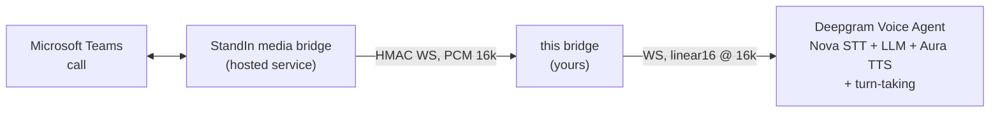

Welcome! **`@komaa/deepgram-msteams-bridge`** (npm: [`@komaa/deepgram-msteams-bridge`](https://www.npmjs.com/package/@komaa/deepgram-msteams-bridge)) puts a [Deepgram Voice Agent](https://developers.deepgram.com/docs/voice-agent) on a real **Microsoft Teams call**.

It is a small Node.js service (and importable TypeScript library) that sits between two WebSockets:

The hosted **StandIn media bridge** ([standin.komaa.com](https://standin.komaa.com)) joins the Teams call and dials into your bridge, one authenticated WebSocket per call. The bridge opens one Deepgram Voice Agent session per call and relays between them. The StandIn wire is base64 **PCM 16 kHz mono** and the Voice Agent session is pinned to `linear16` at 16 kHz both ways, so the hot path is **copy-only**: no resampling, no re-encoding, no transcoding.

## What it does

- **Realtime voice** - the caller talks to your Deepgram agent and hears it reply. Turn-taking, VAD and interruption are the Voice Agent's own; the bridge maps the caller's barge-in onto the Teams side and ghost-drops stale audio so nothing plays after an interruption.
- **No dashboard to configure** - the bridge configures each session itself from environment variables: STT model (`nova-3`), LLM (Deepgram-managed `open_ai`/`anthropic`, or any BYO provider via a think endpoint), voice (`aura-2-thalia-en`), prompt, greeting.
- **Per-call personalization** - caller name, tenant and direction are injected into the agent prompt; a deterministic greeting doubles as a spoken AI disclosure.
- **Built-in agent tools** - `end_call`, `express` (avatar emotion), `show_image` (image on the bot's tile, SSRF-guarded), `look` (vision). Declared automatically as client-side functions in every session.
- **Extensible tools** - register your own function tools the bridge executes in-process. See [Extending the Agent's Tools](/deepgram-msteams-bridge/extending-tools/).
- **Live context without interruptions** - participant counts, DTMF digits and active-speaker changes ride `UpdatePrompt` as a bounded rolling context section.
- **Two call governors** - StandIn-side tier cutoffs get a spoken goodbye; a bridge-side `MAX_CALL_MINUTES` hard cap protects your Deepgram budget. Goodbyes are the exact text on both paths, and both are backstopped.
- **Hardened transport** - replay-proof HMAC handshake, connection and payload caps, duplicate-call rejection, dead-peer detection, `SettingsApplied`-gated audio, opt-in graceful drain, and a `*.deepgram.com` host allowlist so your API key can never be sent elsewhere.

Use the sidebar to navigate. Start with **Getting Started**, or jump to the **Configuration Reference** or **Wire Protocol**. There is also a runnable [example project](https://github.com/komaa-com/deepgram-msteams-bridge/tree/main/examples/basic-bridge) in the repository showing a custom vision hook and a custom `lookup_order` tool.
